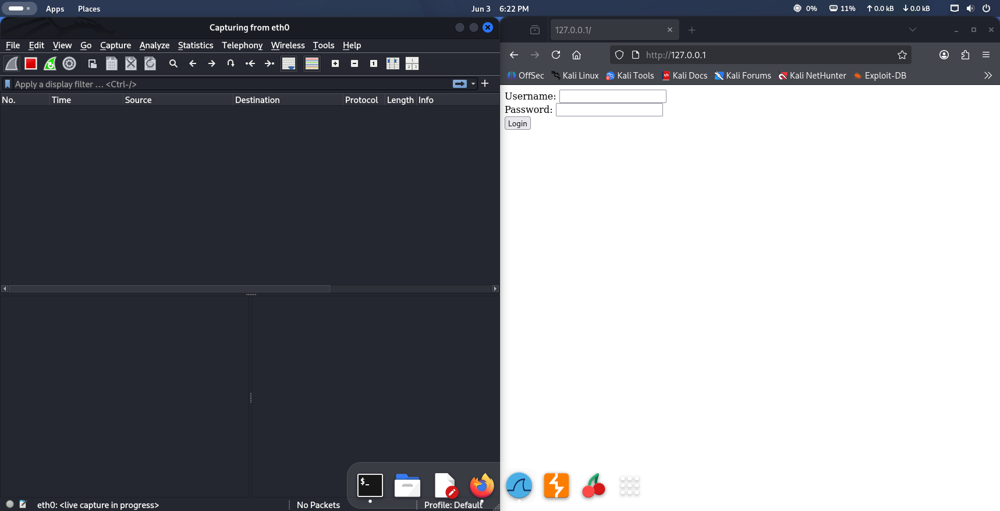
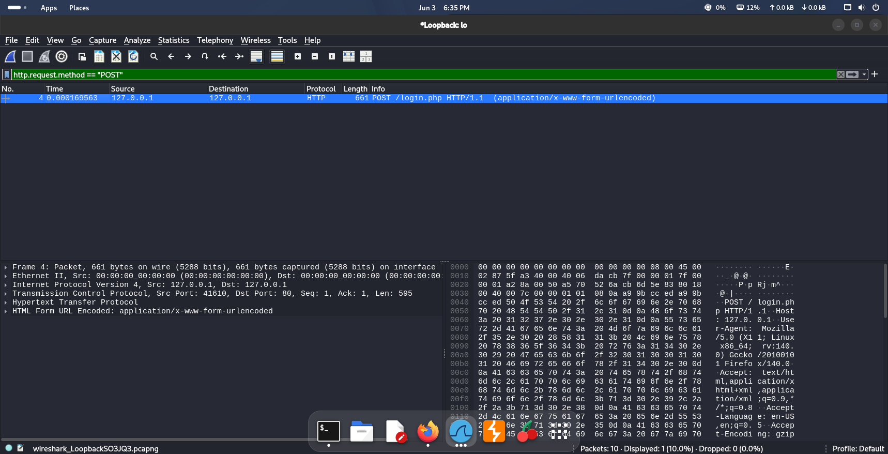

# wireshark-protocol-analysis
Network security lab utilizing Wireshark and an Apache2 web server on Kali Linux to execute Deep Packet Inspection (DPI), isolate application-layer protocols, and analyze cleartext credential exposure

# Network Traffic Analysis & Protocol Security Lab

## Project Overview
This project demonstrates how to capture, analyze, and audit network traffic using **Wireshark** on **Kali Linux**. To evaluate application-layer security vulnerabilities, I engineered a self-hosted environment using an Apache2 web server to host an unencrypted HTTP login form. I then captured and analyzed the authentication traffic to demonstrate the security risks of cleartext protocols.

## Skills Demonstrated
* **Network Analysis:** Deep Packet Inspection (DPI) using Wireshark.
* **Linux Administration:** Deploying and managing local Apache2 web services.
* **Protocol Auditing:** Isolate traffic based on specific OSI layer protocols (HTTP, TCP).
* **Threat Modeling:** Identifying credential harvesting vectors due to a lack of SSL/TLS encryption.

## Step-by-Step Walkthrough

### 1. Environment Setup
I deployed a local web server instance using Apache2 on Kali Linux and created a mock unencrypted login form. I initiated a live packet capture on the Loopback (`lo`) interface to monitor localized traffic.

### 2. Traffic Isolation & Filtering
After executing a mock login attempt, I utilized advanced Wireshark display syntax (`http.request.method == "POST"`) to filter out thousands of background packets and isolate the exact authentication payload.

### 3. Deep Packet Inspection & Credential Extraction
By inspecting the transport and application layer details of the isolated packet, I expanded the `HTML Form URL Encoded` section. Because the traffic lacked TLS encryption, the username and password were completely exposed in clear text.

[Credits](images/Credits.png)

## Remediation & Conclusion
This lab highlights the critical risk of utilizing unencrypted communication channels. Because Layer 7 HTTP traffic transfers payloads in clear text, any attacker executing a Man-in-the-Middle (MitM) attack could intercept sensitive data. 

**Remediation Strategy:** All production web applications must strictly enforce HTTPS by implementing SSL/TLS encryption (Layer 6) and deploying HTTP Strict Transport Security (HSTS) headers to render packet sniffing vectors useless.
